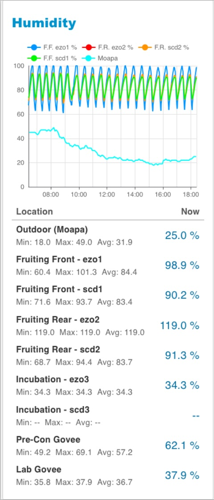
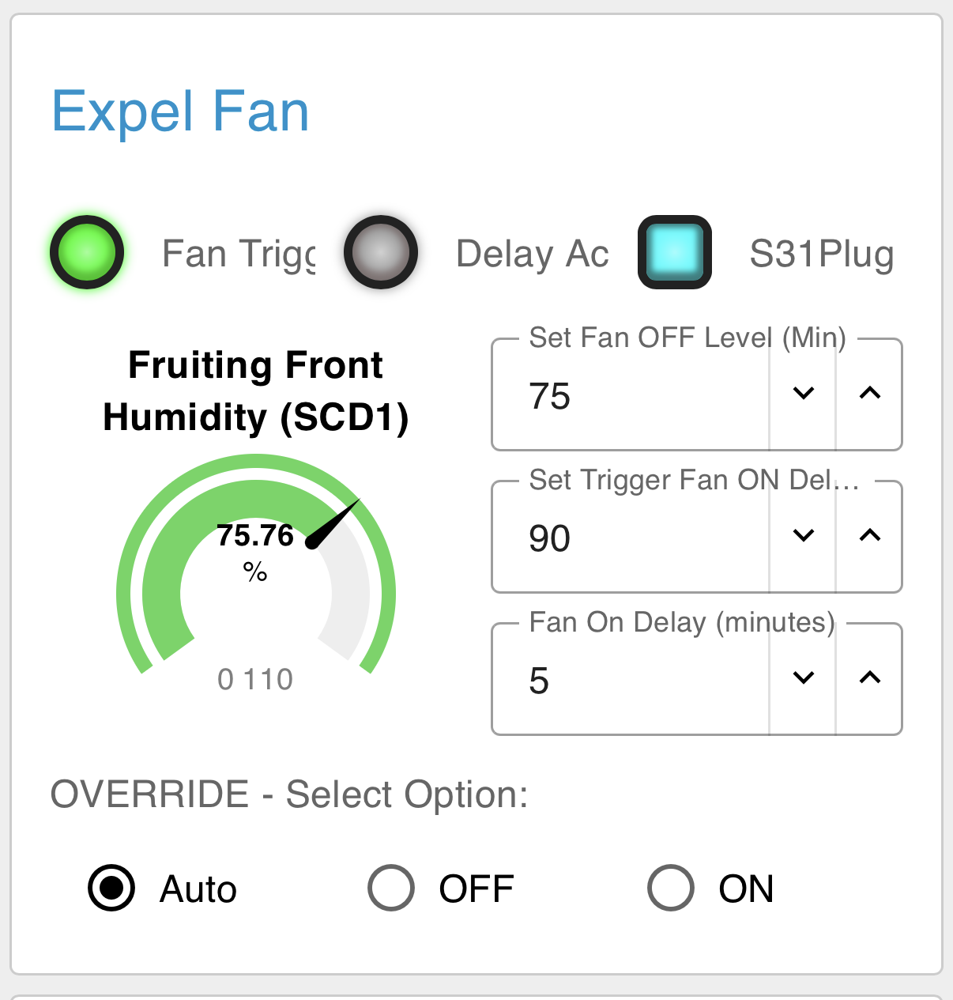
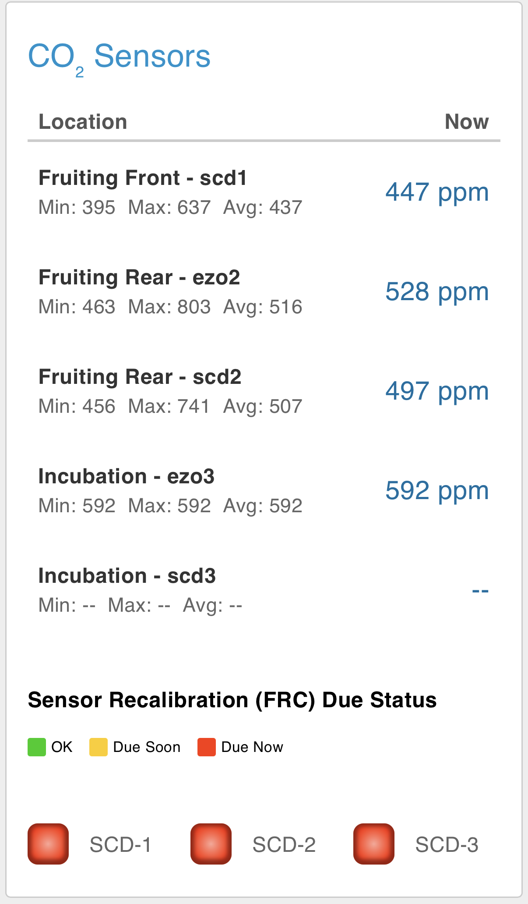
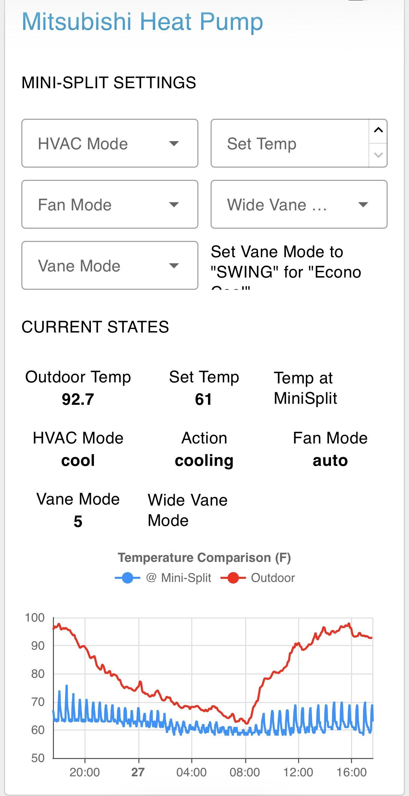
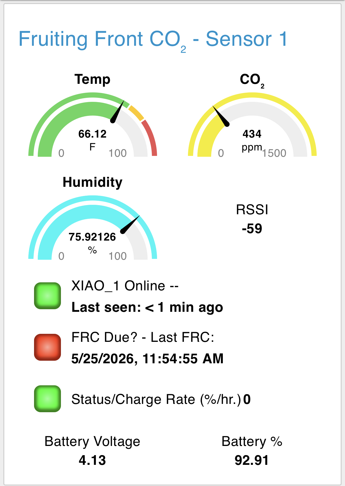
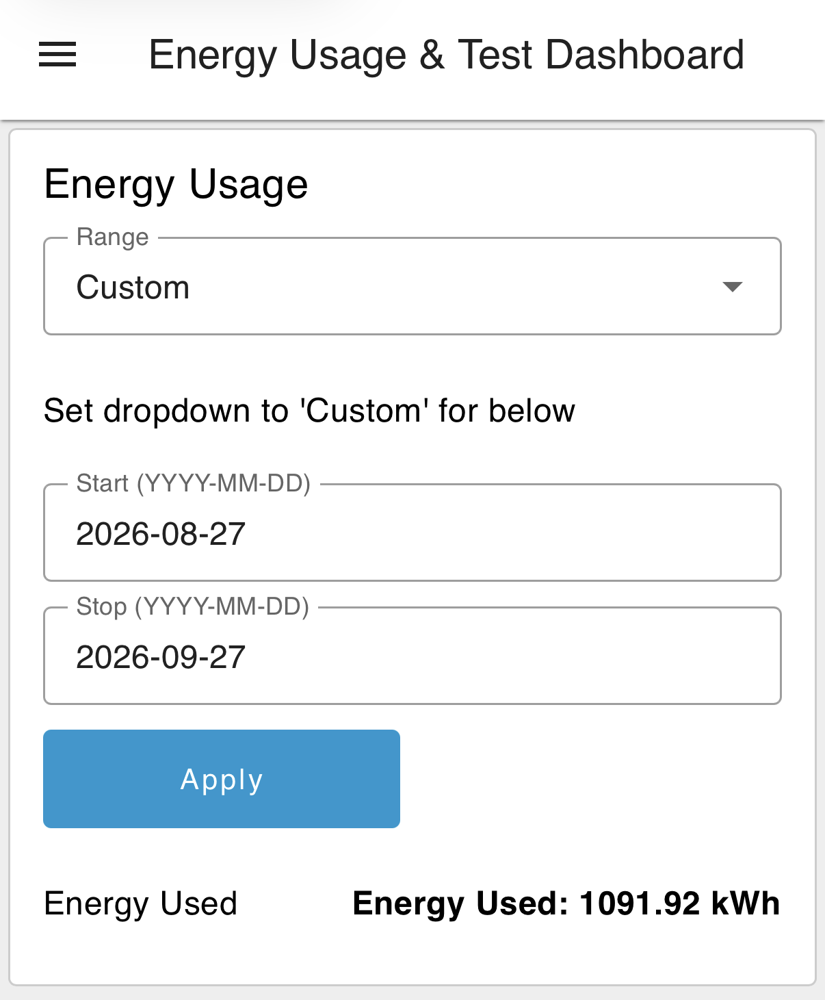

# Mushroom Grow: Node-RED Dashboard 2.0

The phone dashboard for a mushroom grow operation housed in two shipping containers in Nevada. Part of [Bill's Mushroom Grow Project](https://github.com/billjuv/billjuv.github.io).

It's built with **Node-RED** and **FlowFuse Dashboard 2.0** (`@flowfuse/node-red-dashboard`), *not* the old Dashboard 1.0. It's designed first and foremost to be easy to use on a cell phone.

Each section below includes a screenshot, a short description, the devices used, and a link to the Node-RED flow you can import.

---

## What You'll Need

- Node-RED (this was built on v3.1.7)
- FlowFuse Dashboard 2.0 (`@flowfuse/node-red-dashboard`)
- An MQTT broker (Mosquitto here)

**Importing a flow:** In Node-RED, open the menu (☰) → **Import** → paste the JSON (or select the file) → **Import** → **Deploy**. You'll need to point the MQTT nodes at your own broker and adjust topics to match your devices.

---

## Shelly LED Lights

Simple on/off switches for four banks of LED light panels. (Overkill, but they were available.) The fruiting area LEDs run on a timer or can be switched manually from the dashboard.

I did work out a flow to control brightness from Node-RED, but it never got used. My friend set the brightness once in the Shelly app and never touched it again.

**Devices:** Shelly Plus 0-10V Dimmers

**Flow:** [shelly-lights.json](flows/shelly-lights.json)

---

## Humidity

A chart of humidity from several sensors in the fruiting room, plus outdoor humidity from an on-site personal weather station. Also shows Min, Max, and Current humidity.

> **About that 119%:** No, the Fruiting Rear room isn't wetter than water. That EZO sensor died a while back and has been stuck reading 119% ever since. Just ignore that one.

**Devices:** [SCD41](https://github.com/billjuv/XIAO-LoRa-CO2-monitoring), EZO-HUM

**Flow:** [humidity.json](flows/humidity.json)

---

## Humidifier Controls

Humidity comes from a fogger puck and fan combo, plugged into a smart plug. The plug turns on when humidity drops to the minimum you set and off when it reaches the maximum. The reading comes from a sensor at the *opposite* end of the fruiting room from the humidifier, so the whole room gets there, not just the corner.

There are manual override controls, plus a **Pause** button for harvesting and other times you don't want fog in your face.

**Devices:** Wyze smart plug running Tasmota

**Flow:** [humidifier-controls.json](flows/humidifier-controls.json)

---

## Expel Fan

A wall fan pushes excess humidity outdoors, and lowers CO₂ levels along the way. It's set up like the humidifier: you set on/off humidity levels from the dashboard. There's also a programmable shut-off delay, so the humidity lingers a bit before the fan clears it out.

Fan speed is set by an AC motor speed controller (not my choice).

*Future plans:* capture that CO₂ instead of dumping it, and pipe it into an adjacent hydroponic trailer.

**Devices:** Smart plug, AC motor speed controller

**Flow:** [expel-fan.json](flows/expel-fan.json)

---

## Temperatures

Min, Max, Average, and Current temperatures from all sensors, plus outdoors.

**Flow:** [temperatures.json](flows/temperatures.json)

---

## CO₂ Sensors

Min, Max, Average, and Current CO₂ levels. It also shows when each SCD41 sensor is due for recalibration.

**Devices:** [SCD41 LoRa sensor packs](https://github.com/billjuv/XIAO-LoRa-CO2-monitoring)

**Flow:** [co2.json](flows/co2.json)

---

## EC Fan Controls

On/off and speed controls for the EC fans:

- **Lab Fan:** Moves cool air from the air-conditioned lab (wall unit) into the incubation area.
- **Fruiting Fans (2):** Move cooled air from the pre-conditioning room's mini-split into the fruiting room.

**Devices:** [EC Fan ESPHome](https://github.com/billjuv/EC_Fan_ESPHome) control units

**Flow:** [ec-fans.json](flows/ec-fans.json)

---

## Energy Usage

A quick look at current and total energy use, plus a chart of the past 12 hours.

Monitoring is done by a Shelly EM Gen3 on the panel that supplies all the power. It uses just one clamp, and the readings are doubled. Not lab-grade, but close enough.

*Elsewhere:* the billing math lives on its own page. See [Energy Billing](#energy-billing) below.

**Devices:** Shelly EM Gen3 Smart Energy Meter with a 50A clamp

**Flow:** [energy.json](flows/energy.json)

---

## Mitsubishi Heat Pump

Controls and current status of the Mitsubishi mini-split.

**Devices:** [mitsubishi2MQTT](https://github.com/gysmo38/mitsubishi2MQTT) on an ESP8266 NodeMCU board. (Don't bother trying a D1 Mini.)

**Flow:** [heat-pump.json](flows/heat-pump.json)

---

## Alert Controls

Turn off or delay the "humidity is *way* out of range" alerts, which are sent through the RemoteRED app. Useful when you already know, and your phone doesn't need to keep telling you.

**Flow:** [alert-controls.json](flows/alert-controls.json)

---

## Occasional Pages

These live on separate dashboard pages, since they're only needed once in a while.

### CO₂ LoRa Sensors

A closer look at the SCD41 LoRa sensor packs, with each unit's CO₂, temperature, and humidity readings in one place. It's handy for checking that everything is reporting in over LoRa.

**Devices:** [XIAO/LoRa CO2 monitoring](https://github.com/billjuv/XIAO-LoRa-CO2-monitoring) sensor packs, OpenMQTTGateway LoRa receiver

**Flow:** [co2-lora-sensors.json](flows/co2-lora-sensors.json)

### Sensor Calibration

Calibrate the SCD41 sensors remotely over LoRa. Pick a sensor from the dropdown, then:

- **Temperature offset:** Enter it in °F; the flow converts it to what the sensor expects.
- **Altitude:** Enter it in feet; the flow converts it to meters. (The SCD41 uses altitude to correct its CO₂ readings, and the Nevada site sits about 1,100 meters lower than my Colorado test bench.)
- **Set / Get:** Send the new values, or read back what the sensor currently has.

The main CO₂ card shows when a sensor is due for recalibration, and this is where you take care of it.

**Devices:** [XIAO/LoRa CO2 monitoring](https://github.com/billjuv/XIAO-LoRa-CO2-monitoring) sensor packs

**Flow:** [sensor-calibration.json](flows/sensor-calibration.json)

### Energy Billing

Calculates energy use for today, this week, month-to-date, or any custom date range. It's handy when the power bill needs splitting up.

**Devices:** Shelly EM Gen3 (same as the Energy Usage card)

**Flow:** [energy-billing.json](flows/energy-billing.json)

---

## Notes

- Nearly everything here talks MQTT, so it could be ported to Home Assistant without too much trouble.
- Remote access to the dashboard is through RemoteRED; remote programming is done over Tailscale.
